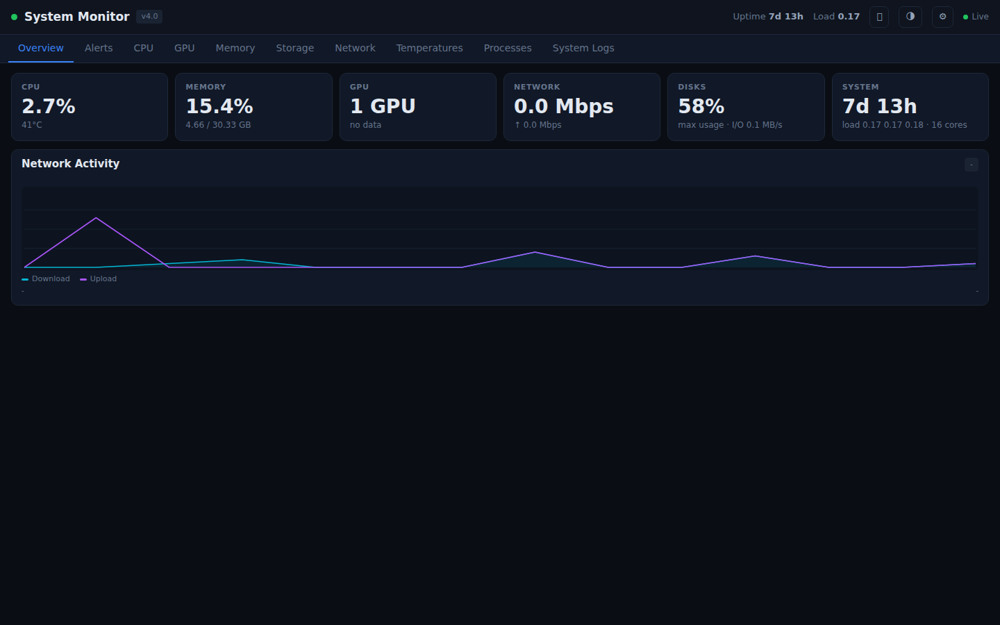
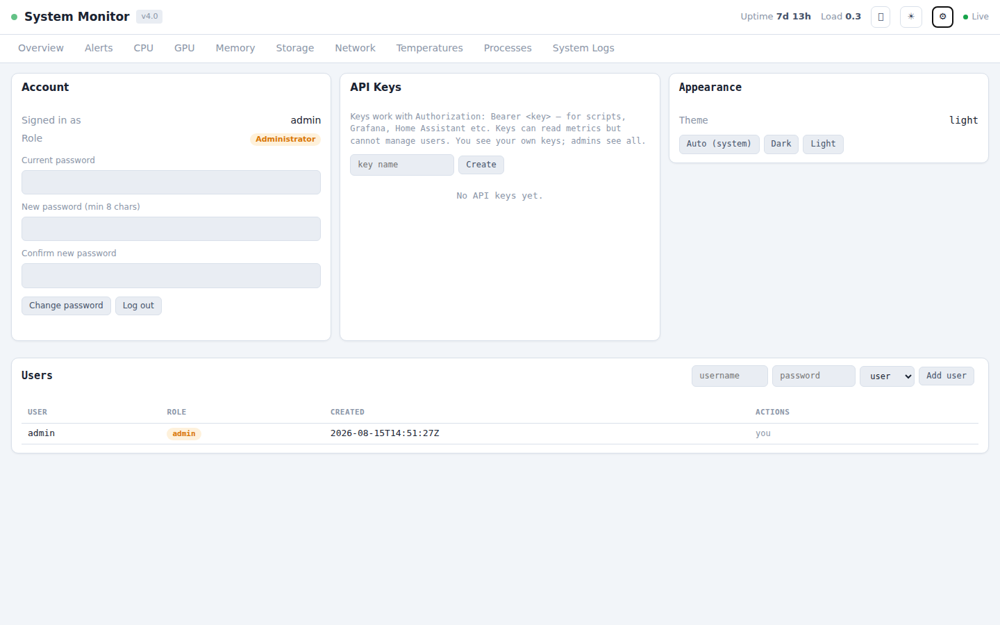
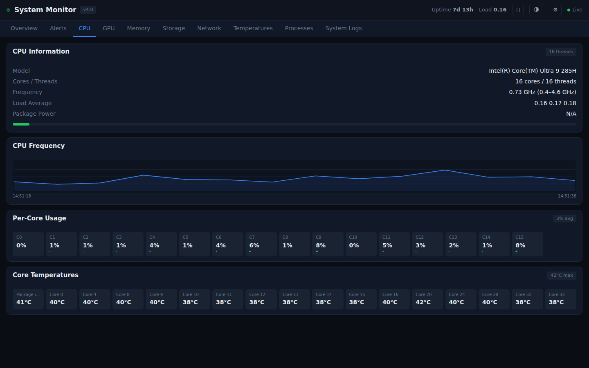
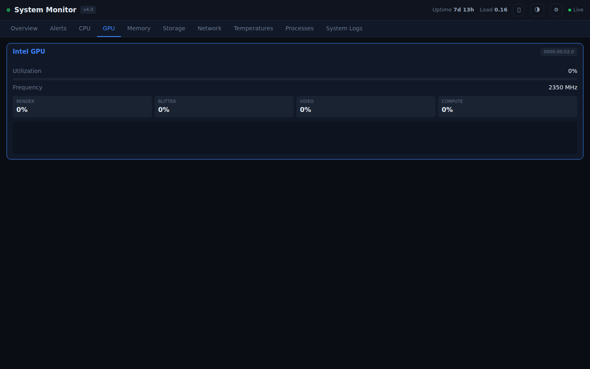
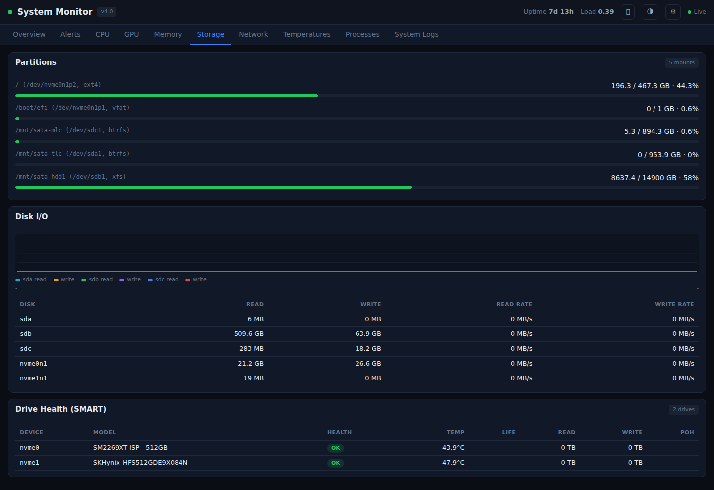
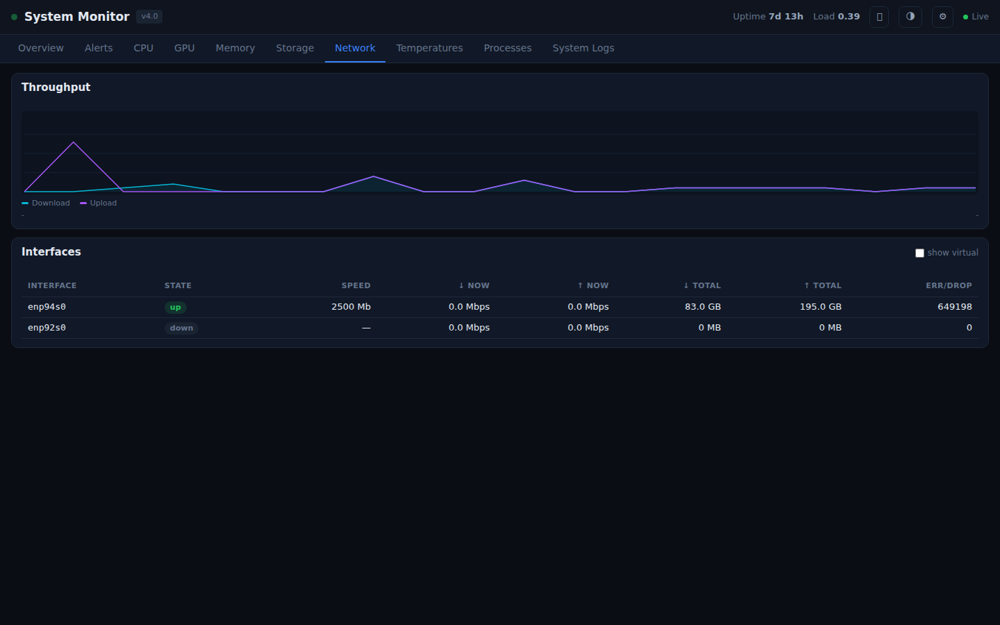
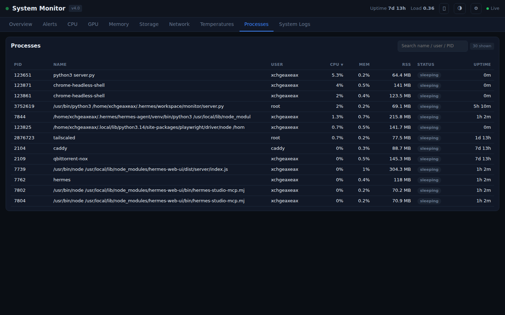
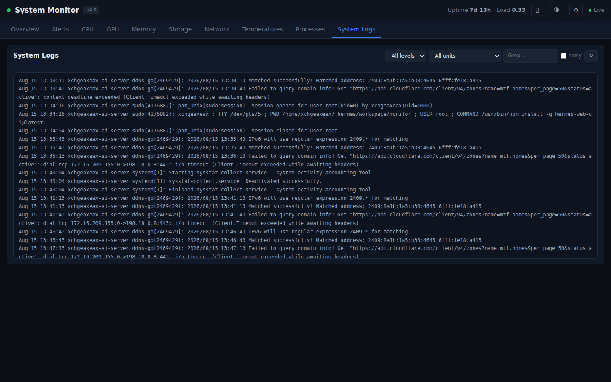
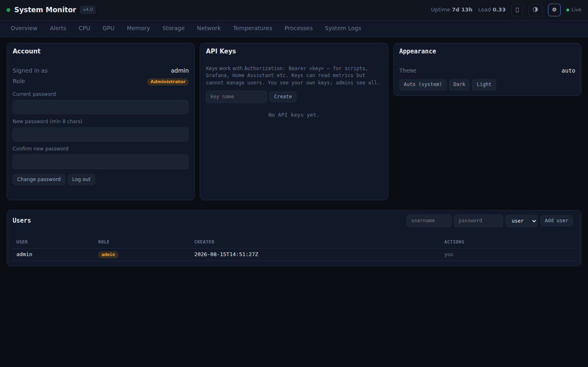
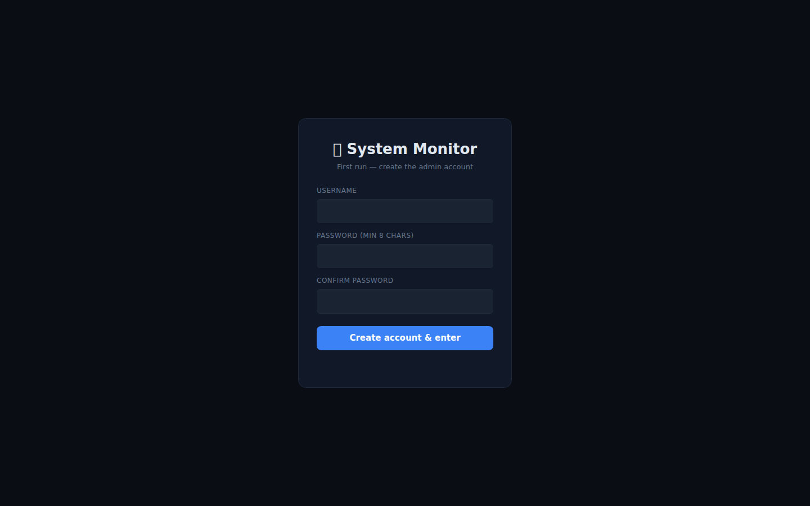

# System Performance Monitor

<div dir="rtl" style="direction:rtl;unicode-bidi:embed">
**轻量级 Linux 系统性能监控面板 · 多用户 · 按需刷新 · 单文件部署**
</div>

**Lightweight Linux system performance monitor · multi-user · on-demand refresh · single-file deployment**

[]()
[]()
[]()

---

## 简介 / Overview

一个面向 AI 服务器 / 家用服务器的轻量级性能监控面板。核心设计：

- **后台采样线程**（1.5s 一次）保持指标热缓存，API 请求毫秒级返回，不阻塞事件循环
- **按需刷新**：浏览器页面不可见时自动停止请求，零后台轮询
- **多用户认证**：管理员 / 普通用户两种角色，管理员管理所有用户
- **告警面板**：阈值告警 + 持久化历史，可确认 / 删除 / 清空
- **黑白双主题**：跟随系统自动切换，也可手动
- **单文件部署**：无数据库、无 Docker，`server.py` + `dashboard.html` 即可运行

A lightweight performance monitor for AI / home servers. Key design:

- **Background sampler thread** (1.5s) keeps metrics hot; API calls return in milliseconds without blocking the event loop
- **On-demand refresh**: the browser stops requesting when the tab is hidden — zero background polling
- **Multi-user auth**: admin / regular roles; admins manage all users
- **Alert panel**: threshold alerts + persistent history; acknowledge / delete / clear
- **Dark & light theme**: follows the system, or manual
- **Single-file deployment**: no database, no Docker — `server.py` + `dashboard.html`

## 特性 / Features

- 🔐 **多用户认证** — 首次打开创建管理员；管理员可创建/删除/重置密码/升降级普通用户；每个用户可管理自己的 API Key
- 🔔 **告警面板** — 磁盘/内存/温度/SMART/负载/VRAM 阈值告警，持久化历史；可确认(ack)、删除(保留日志)、清空
- 🎨 **黑白双主题** — 跟随系统 `prefers-color-scheme` 自动切换，也可手动 深色/浅色/自动
- 📈 **实时图表** — 网络吞吐、CPU 频率、磁盘 I/O、GPU 利用率/VRAM 曲线（Canvas 自绘，断线 + hover 提示）
- 🖥️ **全覆盖** — CPU / GPU(ROCm+Intel+sysfs) / 内存 / 存储+SMART / 网络 / 温度 / 进程 / 系统日志
- ⚡ **高性能** — 采样线程 + 多级缓存（SMART 60s、工具探测 5min），历史按时间窗口裁剪
- 🪶 **自我监控** — 概览页显示本工具自身 CPU / 内存 / 线程数（实测空闲约 1% CPU、~66 MB 内存）；无对应 GPU 时自动跳过厂商工具
- 🔧 **命令行管理** — `monitor-cli.py`：用户、密码、API Key、告警

- 🔐 **Multi-user auth** — first-run admin setup; admins create/delete/reset/demote regular users; each user manages their own API keys
- 🔔 **Alert panel** — disk/memory/temp/SMART/load/VRAM threshold alerts, persistent history; acknowledge / delete / clear
- 🎨 **Dark & light theme** — follows `prefers-color-scheme`, or manual dark/light/auto
- 📈 **Live charts** — network throughput, CPU frequency, disk I/O, GPU utilization/VRAM (custom Canvas, gap-aware + hover tooltip)
- 🖥️ **Full coverage** — CPU / GPU (ROCm+Intel+sysfs) / memory / storage+SMART / network / temps / processes / system logs
- ⚡ **High performance** — sampler thread + multi-level caching (SMART 60s, tool probe 5min), time-windowed history
- 🪶 **Self-monitoring** — the overview shows the tool's own CPU / RSS / threads (measured ~1% CPU, ~66 MB RSS idle); GPU sampler skips vendor tools when no such GPU is present
- 🔧 **CLI management** — `monitor-cli.py`: users, passwords, API keys, alerts

## 界面预览 / Screenshots

| 概览（深色）/ Overview (dark) | 概览（浅色）/ Overview (light) |
|:---:|:---:|
|  |  |

| CPU | GPU |
|:---:|:---:|
|  |  |

| 存储 / Storage | 网络 / Network |
|:---:|:---:|
|  |  |

| 进程 / Processes | 系统日志 / System Logs |
|:---:|:---:|
|  |  |

| 设置（用户 & API Key）/ Settings | 首次创建管理员 / First-run setup |
|:---:|:---:|
|  |  |

## 角色与权限 / Roles & Permissions

| 能力 / Capability | 管理员 admin | 普通用户 user |
|------|:---:|:---:|
| 查看所有监控数据 / View all metrics | ✅ | ✅ |
| 管理告警 / Manage alerts | ✅ | ✅ |
| 创建/删除/重置/升降级用户 / Manage users | ✅ | ❌ |
| 管理自己的 API Key / Manage own API keys | ✅ | ✅ |
| 查看所有 API Key / View all API keys | ✅ | 仅自己的 own only |
| 修改自己的密码 / Change own password | ✅ | ✅ |

## 快速部署 / Quick Start

```bash
# 克隆 / clone
git clone https://github.com/xchgeaxeax/system-monitor.git
cd system-monitor

# Root 模式（完整功能：SMART/日志）/ Root mode (full features)
sudo bash deploy.sh --root

# User 模式（基本功能）/ User mode (basic features)
bash deploy.sh --user

# 自定义端口 / custom port
bash deploy.sh --root --port 8080
```

首次访问面板会显示**创建管理员账号**界面 / First visit shows the **create admin account** screen.

> 反向代理（Caddy/nginx）下建议 `AI_MONITOR_HOST=127.0.0.1`，只监听本机。
> Behind a reverse proxy, set `AI_MONITOR_HOST=127.0.0.1` to bind to loopback only.

## 命令行管理 / CLI Management

```bash
# 状态 / status
python3 monitor-cli.py status

# 用户管理（需要 root）/ user management (root)
python3 monitor-cli.py user list
python3 monitor-cli.py user create <user> <password> [admin|user]
python3 monitor-cli.py user delete <user>
python3 monitor-cli.py user reset-password <user> [new-password]
python3 monitor-cli.py user role <user> <admin|user>

# 重置第一个管理员密码（兼容旧命令）/ reset first admin (legacy)
sudo python3 monitor-cli.py reset-password [new-password]

# API Key / API keys
python3 monitor-cli.py key list
python3 monitor-cli.py key create <name> [owner]
python3 monitor-cli.py key delete <name>

# 告警 / alerts
python3 monitor-cli.py alerts                        # 查看 list
python3 monitor-cli.py alerts add "维护中" warning    # 手动添加 add (pinned)
python3 monitor-cli.py alerts ack <rule_id>          # 确认 acknowledge
python3 monitor-cli.py alerts delete <rule_id>       # 删除 delete
python3 monitor-cli.py alerts clear                  # 清空已解决 clear resolved
```

> CLI 与服务器必须指向同一数据目录。若服务器设置了 `AI_MONITOR_DATA_DIR`，
> CLI 也要 `export AI_MONITOR_DATA_DIR=...`
> The CLI must point at the same data dir as the server. If the server sets
> `AI_MONITOR_DATA_DIR`, the CLI must `export AI_MONITOR_DATA_DIR=...` too.

## API Key 使用 / Using API Keys

```bash
curl -H "Authorization: Bearer ***" https://monitor.example.com/api/summary
curl -H "Authorization: Bearer ***" https://monitor.example.com/api/gpu
```

Web 登录方式：`Authorization: Bearer <session token>`（登录后浏览器自动携带）。
Web login uses `Authorization: Bearer <session token>` (the browser carries it automatically after login).

## 配置（环境变量）/ Configuration (env vars)

| 变量 / Var | 默认 / Default | 说明 / Description |
|------|--------|------|
| AI_MONITOR_PORT | 9527 | 监听端口 / listen port |
| AI_MONITOR_HOST | 0.0.0.0 | 监听地址（反代建议 127.0.0.1）/ bind address |
| AI_MONITOR_DATA_DIR | ./data | 认证/告警数据目录 / auth & alert data dir |
| AI_MONITOR_DEBUG | 0 | 调试模式（开启 /api/all）/ debug mode |
| AI_MONITOR_SAMPLE_INTERVAL | 1.5 | 采样间隔（秒）/ sample interval (s) |
| AI_MONITOR_GPU_SAMPLE_INTERVAL | 2.0 | GPU 采样间隔（秒，越高越省 CPU）/ GPU sample interval (s) |
| AI_MONITOR_HISTORY_WINDOW | 300 | 历史曲线保留时长（秒）/ history window (s) |
| AI_MONITOR_SMART_TTL | 60 | SMART 采集缓存（秒）/ SMART cache (s) |
| AI_MONITOR_SESSION_TTL | 43200 | Web 会话有效期（秒）/ session TTL (s) |
| AI_MONITOR_ROCM_SMI | rocm-smi | ROCm SMI 路径 |
| AI_MONITOR_INTEL_GPU_TOP | intel_gpu_top | Intel GPU Top 路径 |
| AI_MONITOR_SMARTCTL | smartctl | smartctl 路径 |
| AI_MONITOR_NVME | nvme | nvme CLI 路径 |
| AI_MONITOR_JOURNALCTL | journalctl | journalctl 路径 |

## API 端点 / API Endpoints

| 端点 / Endpoint | 说明 / Description | 认证 / Auth |
|------|------|------|
| `/` | Dashboard 页面 | 公开 public |
| `/api/health` | 健康检查（探活）/ health check | 公开 public |
| `/api/auth/status` | 是否已配置认证 | 公开 public |
| `/api/auth/setup` | 首次创建管理员 | 公开 public |
| `/api/auth/login` · `/logout` | 登录 / 登出 | — |
| `/api/summary` · `/api/quick-stats` | 概览 / overview | 需要 auth |
| `/api/monitor` | 本工具自身占用（CPU/内存/线程）/ self footprint | 需要 auth |
| `/api/cpu` · `/gpu` · `/memory` · `/storage` · `/network` · `/temps` | 详情 / details | 需要 auth |
| `/api/net-history` · `/gpu-history` · `/cpu-freq-history` · `/disk-io-history` | 曲线数据 / chart data | 需要 auth |
| `/api/processes?sort_by=&search=` | 进程 / processes | 需要 auth |
| `/api/logs?lines=&unit=&search=&level=&noisy=` | 系统日志 / system logs | 需要 auth |
| `/api/alerts` | 告警快照 / alert snapshot | 需要 auth |
| `/api/alerts/ack?rule_id=` (POST) | 确认告警 / acknowledge | 需要 auth |
| `/api/alerts/active?rule_id=` (DELETE) | 删除告警 / delete alert | 需要 auth |
| `/api/alerts/history/{i}` (DELETE) | 删除历史条目 / delete history | 需要 auth |
| `/api/alerts/clear-resolved` (POST) | 清空已解决 / clear resolved | 需要 auth |
| `/api/users` (GET/POST) | 列出 / 创建用户 / list/create users | 仅管理员 admin |
| `/api/users/{user}` (DELETE) | 删除用户 / delete user | 仅管理员 admin |
| `/api/users/{user}/password` (POST) | 重置用户密码 / reset password | 仅管理员 admin |
| `/api/users/{user}/role` (POST) | 升降级用户 / change role | 仅管理员 admin |
| `/api/auth/keys` (GET/POST/DELETE) | API Key 管理 | 需要（普通用户仅自己的）auth (own only for users) |
| `/api/auth/password` (POST) | 修改自己的密码 / change own password | 需要 auth |
| `/api/docs` | API 文档 / API docs | 需要 auth |

## 告警规则 / Alert Rules

| 规则 / Rule | 条件 / Condition | 级别 / Level |
|------|------|------|
| 磁盘占用 / Disk usage | ≥90%（≥95% danger） | warning/danger |
| 内存占用 / Memory | ≥90%（≥95% danger） | warning/danger |
| Swap | ≥80% | warning |
| 负载 / Load | 1min load ≥ 2× cores | warning |
| 温度 / Temperature | > 90% of critical | danger |
| SMART | critical_warning / health=CHECK | danger |
| NVMe 寿命 / NVMe life | percentage_used ≥ 90% | warning |
| GPU VRAM | ≥95% | warning |

告警自动触发 / 自动恢复（数据源缺失时不会误报恢复）。手动添加的告警为固定告警，只能手动删除。
Alerts auto-trigger / auto-resolve (no false resolution when a data source is missing). Manually added alerts are pinned and can only be removed manually.

## 系统要求 / Requirements

- Linux（Ubuntu/Debian/CentOS/Fedora/openSUSE）
- Python 3.8+，`fastapi` / `uvicorn` / `psutil`
- systemd

## 可选工具 / Optional Tools

| 工具 / Tool | 用途 / Purpose | 安装 / Install |
|------|------|------|
| intel-gpu-tools | Intel GPU 监控 | `apt install intel-gpu-tools`（需 `setcap cap_perfmon+ep`） |
| rocm-smi | AMD GPU 监控 | `apt install rocm-smi-lib` |
| smartmontools | SATA SMART | `apt install smartmontools` |
| nvme-cli | NVMe SMART | `apt install nvme-cli` |

## 卸载 / Uninstall

```bash
sudo systemctl stop system-monitor && sudo systemctl disable system-monitor
sudo rm /etc/systemd/system/system-monitor.service
sudo systemctl daemon-reload
rm -rf /opt/system-monitor   # 含 data/ 认证数据 / includes data/ auth data
```

## 完整文档 / Full Documentation

- 中文 / Chinese: [DOCUMENTATION.zh.md](DOCUMENTATION.zh.md)
- English: [DOCUMENTATION.md](DOCUMENTATION.md)

## License

MIT
